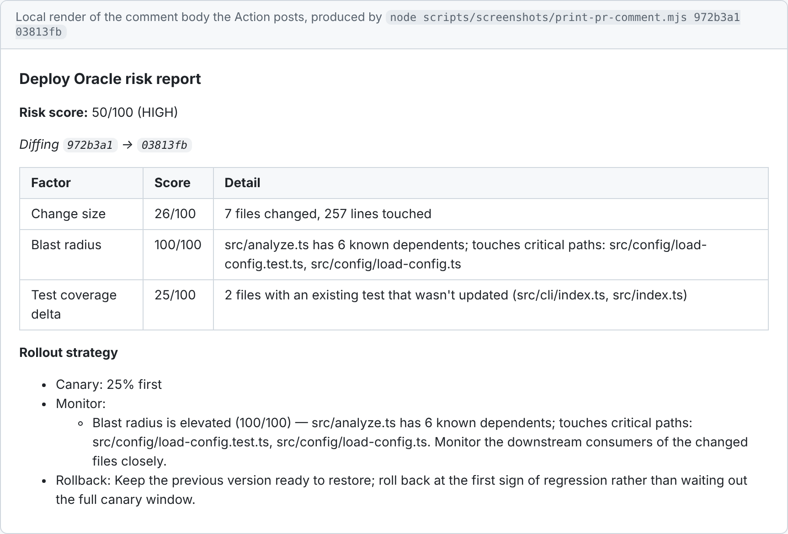
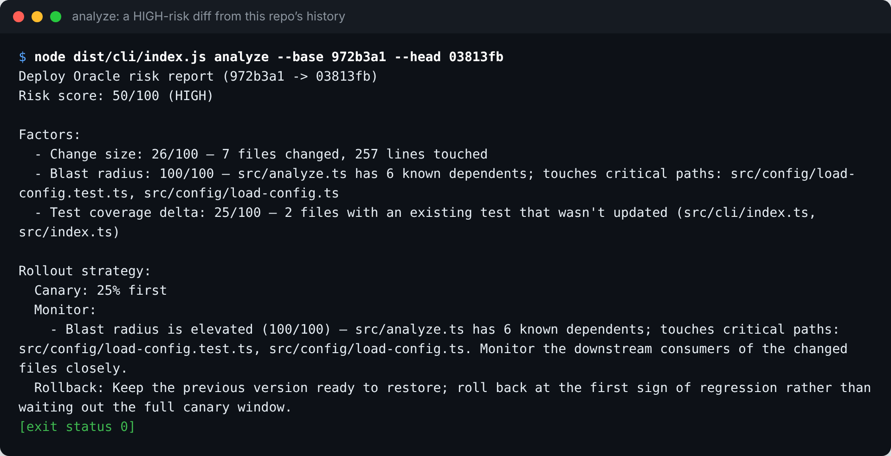
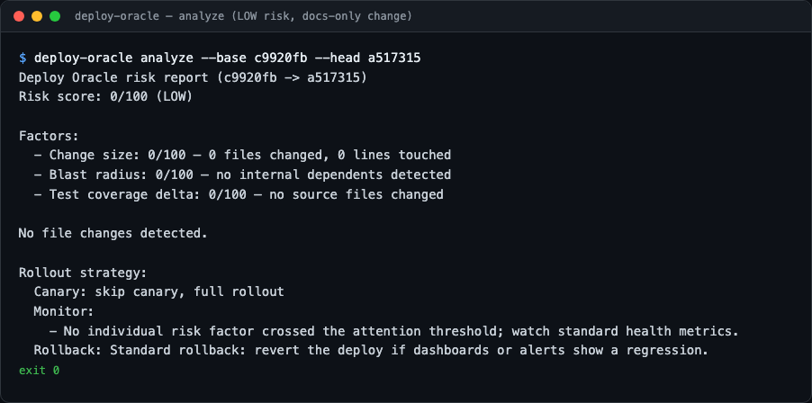
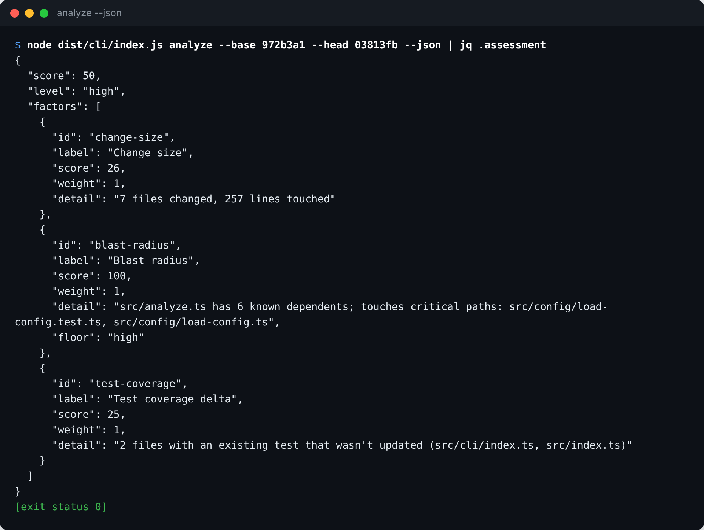
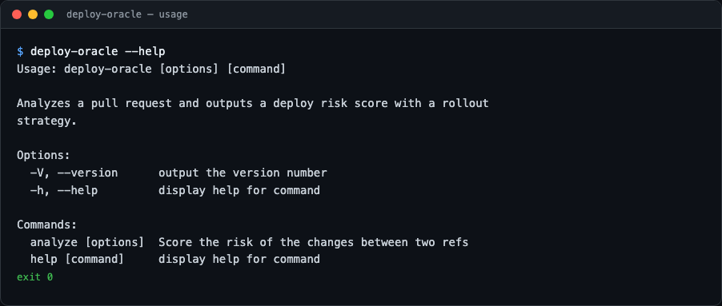
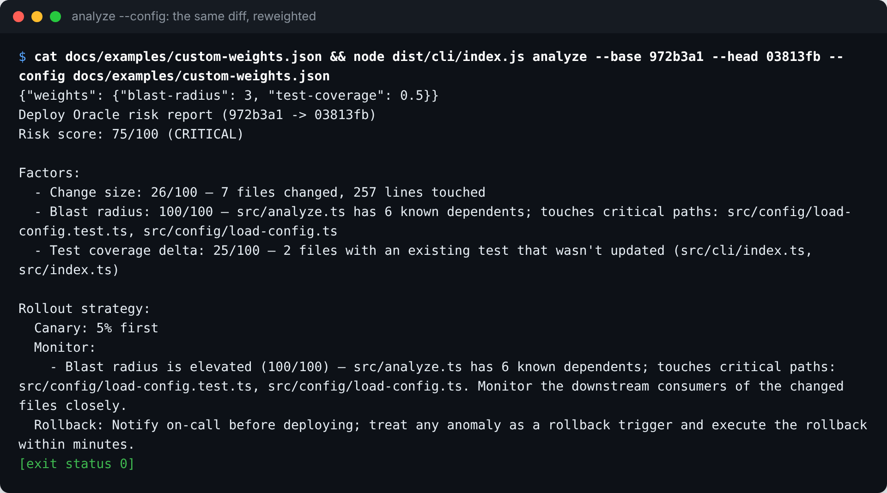

# deploy-oracle

[](https://github.com/tenalisriharsha/deploy-oracle/actions/workflows/ci.yml)

A deployment risk scoring tool. `deploy-oracle` analyzes a pull request —
files changed, blast radius, test coverage delta, and change size — and
outputs a deploy risk score with a recommended rollout strategy: canary
percentage, monitoring focus areas, and a rollback plan. It ships as both a
CLI and a GitHub Action that comments the score directly on PRs.

## Preview

What lands on the PR: the Markdown the report formatter produces, rendered
locally (not a screenshot of a live GitHub comment):



<details>
<summary>More views</summary>











Every image is produced by
[`scripts/screenshots/generate.mjs`](scripts/screenshots/generate.mjs), which
runs the command shown in each image and captures its real output and exit
status. Scores depend on the checkout they were generated from (see the
working-tree note under [Usage (CLI)](#usage-cli)).

</details>

## Project Status

Feature-complete: all planned phases (scoring engine, blast radius, test
coverage delta, rollout recommendations, the GitHub Action, config file
support, CI) are done, tested, and wired end-to-end. See
[PROGRESS.md](./PROGRESS.md) for the architecture and phased build history,
and [DAILY_REPORT.md](./DAILY_REPORT.md) for a summary of what was built
each night.

## Usage (CLI)

```sh
npm install
npm run build

# Score the working tree against HEAD
node dist/cli/index.js analyze

# Score one ref against another, e.g. in CI: base branch vs. PR head
node dist/cli/index.js analyze --base main --head HEAD

# Machine-readable output
node dist/cli/index.js analyze --json

# Use a config file at a non-default path (fails if the file does not exist)
node dist/cli/index.js analyze --config risk-config.json
```

Two things to know about what gets scored:

- Without `--head`, the diff is `git diff <base>` against the working tree,
  so untracked files are not included until they are `git add`ed.
- The diff comes from `--base`/`--head`, but the import graph, the list of
  existing tests and any coverage report are read from the files currently
  checked out in `cwd`. Scoring an old range from a newer checkout can
  therefore give a different blast-radius or test-coverage score than
  scoring it with that head checked out (the Action always runs with the PR
  head checked out).

Example output (`node dist/cli/index.js analyze --base 972b3a1 --head 03813fb`,
run on this repository):

```
Deploy Oracle risk report (972b3a1 -> 03813fb)
Risk score: 50/100 (HIGH)

Factors:
  - Change size: 26/100 — 7 files changed, 257 lines touched
  - Blast radius: 100/100 — src/analyze.ts has 6 known dependents; touches critical paths: src/config/load-config.test.ts, src/config/load-config.ts
  - Test coverage delta: 25/100 — 2 files with an existing test that wasn't updated (src/cli/index.ts, src/index.ts)

Rollout strategy:
  Canary: 25% first
  Monitor:
    - Blast radius is elevated (100/100) — src/analyze.ts has 6 known dependents; touches critical paths: src/config/load-config.test.ts, src/config/load-config.ts. Monitor the downstream consumers of the changed files closely.
  Rollback: Keep the previous version ready to restore; roll back at the first sign of regression rather than waiting out the full canary window.
```

## Usage (GitHub Action)

Add it to a workflow that checks out the PR with full history (the action
needs to diff against the actual base commit, which a shallow checkout
won't have):

```yaml
name: Deploy Oracle
on:
  pull_request:
    branches: [main]

permissions:
  contents: read
  pull-requests: write

jobs:
  analyze:
    runs-on: ubuntu-latest
    steps:
      - uses: actions/checkout@v4
        with:
          fetch-depth: 0
      - uses: tenalisriharsha/deploy-oracle@main
```

On a `pull_request` event the action diffs the PR's base and head commits
automatically and posts the report as a PR comment, editing that same
comment on subsequent pushes instead of piling up duplicates. Inputs:

| Input   | Required | Default               | Description                             |
| ------- | -------- | --------------------- | --------------------------------------- |
| `base`  | no       | the PR's base commit  | Ref/sha to diff against                 |
| `head`  | no       | the PR's head commit  | Ref/sha to diff                         |
| `token` | no       | `${{ github.token }}` | Token used to read and post the comment |

If the action isn't running on a `pull_request` event (or `base` can't be
resolved another way), set `base`/`head` explicitly; the report still
prints to the job log even when there's no PR to comment on.

Example PR comment body for the same diff (output of
`node scripts/screenshots/print-pr-comment.mjs 972b3a1 03813fb`):

> ### Deploy Oracle risk report
> **Risk score:** 50/100 (HIGH)
>
>
> _Diffing `972b3a1` → `03813fb`_
>
> | Factor | Score | Detail |
> | --- | --- | --- |
> | Change size | 26/100 | 7 files changed, 257 lines touched |
> | Blast radius | 100/100 | src/analyze.ts has 6 known dependents; touches critical paths: src/config/load-config.test.ts, src/config/load-config.ts |
> | Test coverage delta | 25/100 | 2 files with an existing test that wasn't updated (src/cli/index.ts, src/index.ts) |
>
> **Rollout strategy**
> - Canary: 25% first
> - Monitor:
>   - Blast radius is elevated (100/100) — src/analyze.ts has 6 known dependents; touches critical paths: src/config/load-config.test.ts, src/config/load-config.ts. Monitor the downstream consumers of the changed files closely.
> - Rollback: Keep the previous version ready to restore; roll back at the first sign of regression rather than waiting out the full canary window.

The action edits this same comment (matched via a hidden HTML marker) on
every subsequent push to the PR, instead of piling up a new one each time.

## Configuration

Drop a `.deployoraclerc.json` in the repo root to tune thresholds, the
critical-path glob list, and per-factor weights without touching source.
Every field is optional — anything you omit falls back to its default:

```json
{
  "changeSize": {
    "maxFiles": 30,
    "maxLines": 1000
  },
  "blastRadius": {
    "maxDependents": 15,
    "criticalPathGlobs": ["**/auth/**", "**/*payment*", "**/migrations/**"],
    "criticalPathFloor": "high"
  },
  "testCoverage": {
    "lowCoverageThreshold": 50
  },
  "weights": {
    "change-size": 1,
    "blast-radius": 2,
    "test-coverage": 1
  }
}
```

- `changeSize.maxFiles` / `changeSize.maxLines` — file/line counts at which
  the change-size factor saturates at 100.
- `blastRadius.maxDependents` — known-dependent count at which the fan-in
  score saturates at 100.
- `blastRadius.criticalPathGlobs` — replaces (not merges with) the default
  glob list; any changed file matching one of these scores 100 regardless of
  fan-in.
- `blastRadius.criticalPathFloor` — the minimum overall level imposed when a
  changed file matches a critical-path glob: `none`, `low`, `medium`, `high`
  (the default) or `critical`. See [Critical path floor](#critical-path-floor).
  An unknown value fails loudly instead of being ignored.
- `testCoverage.lowCoverageThreshold` — line-coverage percentage (from an
  Istanbul `coverage-summary.json`, if present) below which an existing test
  is treated as insufficient.
- `weights` — overrides a risk factor's contribution to the overall score,
  keyed by factor id (`change-size`, `blast-radius`, `test-coverage`).
  Defaults to `1` for every factor; `0` excludes a factor from the score
  entirely while still showing it in the report.

The CLI loads this file from `cwd` automatically (override the path with
`--config <path>`); the Action needs nothing extra since it already resolves
`cwd` to `GITHUB_WORKSPACE`. A present-but-invalid config file fails loudly
rather than silently falling back to defaults.

## Risk factors

- **Change size** — files touched + lines churned, saturating past a
  configurable threshold. Bigger diffs are harder to review carefully.
- **Blast radius** — builds a local import graph (regex-based, resolves
  relative `import`/`require` specifiers) and flags changed files with many
  known dependents. Also flags any changed file matching a configurable
  critical-path glob list (auth, payments, billing, migrations, security,
  config) as high risk regardless of fan-in, since static analysis alone
  can't see every caller.
- **Test coverage delta** — correlates each changed source file against
  test files changed in the same diff and existing test files in the repo.
  A source change with no corresponding test anywhere is the highest risk;
  an existing-but-unchanged test is a middling risk. If an Istanbul-style
  `coverage/coverage-summary.json` report is present, low reported line
  coverage on a file is treated the same as having no test at all.

### Critical path floor

The overall score is a weighted average, and an average can dilute one decisive
signal. A one-file migration that drops a table scores 100 on blast radius,
but next to a tiny diff and no source files to cover it averages out to 34,
which is MEDIUM and a 50% canary. A change like that should not get a looser
rollout just because it is small.

So when any changed file matches a critical-path glob, blast radius also sets
a **floor** on the overall level (`high` by default). The level is raised to
the floor and the score is lifted to that level's lower bound, so the two
never disagree, and the report says it happened:

```
Risk score: 50/100 (HIGH)
Floor: raised from MEDIUM (weighted score 34) to HIGH because blast radius is on a critical path
```

A floor only ever raises the level, never lowers it. Set the blast-radius
weight to `0` to exclude that factor entirely, including its floor, or set
`criticalPathFloor` to `none` to go back to the plain weighted average.

Limits worth knowing: the floor reacts to file paths, so it does not know
whether a change is actually reversible (a feature flag flip versus a
destructive migration), and it is only as good as your glob list.

## Rollout strategy

Every analysis also produces a `RolloutStrategy`: a canary percentage, a
rollback plan, and a list of monitoring focus areas. Canary sizing and the
rollback plan follow the overall risk level:

| Level    | Canary             | Rollback posture                               |
| -------- | ------------------ | ---------------------------------------------- |
| low      | 100% (skip canary) | standard: revert if dashboards/alerts regress  |
| medium   | 50%                | hold at canary until metrics look stable       |
| high     | 25%                | roll back at the first sign of regression      |
| critical | 5%                 | notify on-call first; roll back within minutes |

Monitoring focus areas are pulled from whichever individual risk factors
crossed an attention threshold (score ≥ 50), so the plan calls out _what_ to
watch — e.g. "blast radius is elevated, monitor the downstream consumers of
`src/auth/login.ts` closely" — rather than just how carefully to watch it.

## Development

```sh
npm install
npm test         # run the test suite
npm run typecheck
npm run lint
npm run build
```

## License

[MIT](./LICENSE)
